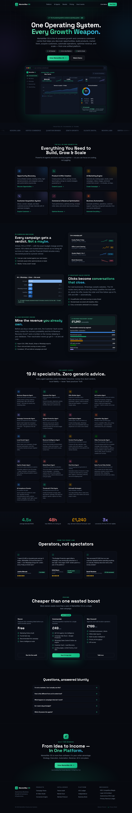
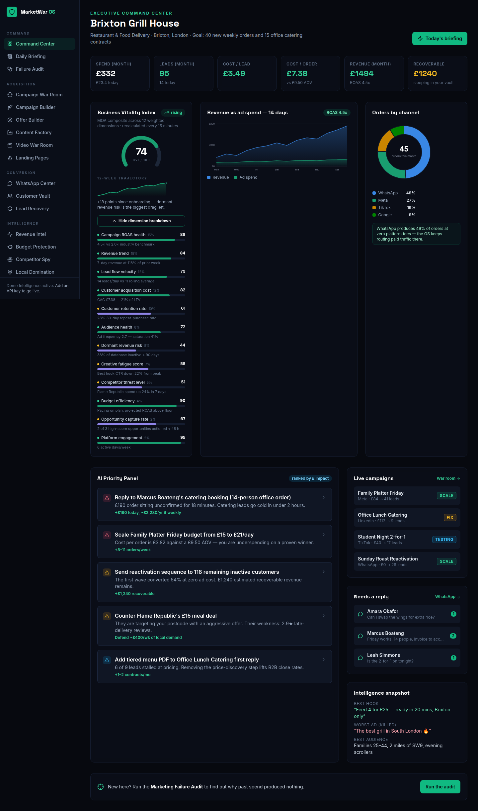
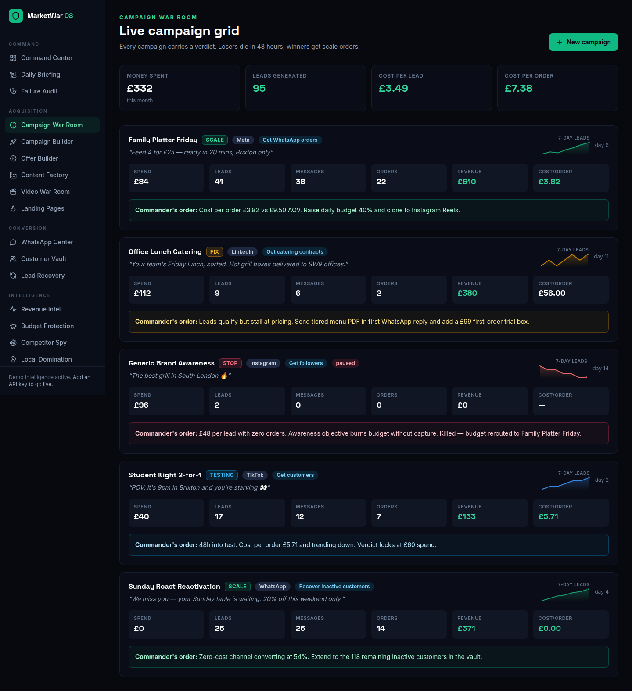
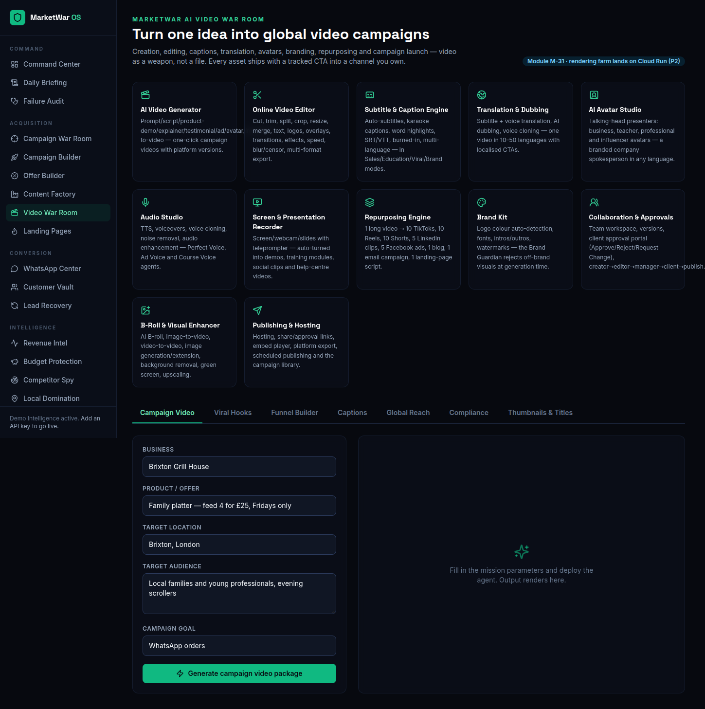

# MarketWar OS

**The AI-powered growth & commerce operating system.** MarketWar OS enables anyone to discover
opportunities, create and market products, acquire customers, automate operations, optimise
revenue, and scale a business — from a single unified platform.

> Stop guessing. Launch, test, kill, improve, and convert automatically.

## The look

| | |
|---|---|
|  |  |
|  |  |

**→ [Full screenshot gallery — all 19 screens](docs/screenshots/README.md)**

Most tools create content. MarketWar OS diagnoses the business, rebuilds the offer, creates
campaigns, launches experiments, tracks leads, protects the budget and tells the user exactly
what to do next.

## Platform modules

| Module | What it does |
|---|---|
| **Marketing Failure Audit** | Scores conversion risk, offer weakness, audience mismatch, trust and funnel leaks — the "why you got 0 customers" report |
| **Executive Command Center** | Live metrics bar, AI priority panel ranked by £ impact, campaign and conversation feeds |
| **Campaign War Room** | Every campaign carries a blunt SCALE / FIX / STOP verdict with the exact next action |
| **One-Click Campaign Builder** | Pick a goal → objective, audience, budget split, kill criteria and 7-day battle plan |
| **Offer Builder** | Volume, margin and recovery offers engineered with urgency and margin-safety checks |
| **Content Factory** | Strike plans where every post routes attention into channels you own |
| **Video War Room** | One idea → global video campaigns: generator, captions (4 modes), translation/dubbing, avatars, repurposing (1 long video → 40+ assets), brand kit, approvals |
| **Landing Page Generator** | Conversion pages + WhatsApp flow + 48-hour follow-up sequence designed as one system |
| **WhatsApp Sales Center** | Ad → WhatsApp → AI qualification → order pipeline with intent scoring |
| **Customer Intelligence Vault** | Contacts scored for engagement, intent, churn risk and recoverable revenue |
| **Lead Recovery Engine** | AI Revenue Recovery Score™ — reactivates the money sleeping in your database |
| **Budget Protection** | Pauses spend that produces no leads and reroutes it to winners, with a receipt |
| **Competitor Spy** | Threat board, exploitable gaps and ready-to-launch counter-campaigns |
| **Local Domination** | Google Business attack plans, community distribution, geo-offer grids |
| **Revenue Intelligence** | Attribution by campaign/channel, leak detection and 30-day forecasts |
| **Daily Briefing** | The AI Growth Strategist issues max five ranked orders per day |

## The agent corps

Business Diagnosis · Customer Pain · Offer Builder · Ad Creative · Campaign Commander ·
Budget Protection · Lead Capture · Competitor Spy · Local Growth · Revenue Intelligence ·
Content Factory · AI Growth Strategist

Every agent runs under the **Master Directive**: zero generic info, money first, blunt
SCALE / FIX / STOP verdicts, local fidelity, structured output.

## Getting started

```bash
npm install
npm run dev
```

Open [http://localhost:3000](http://localhost:3000).

The platform boots in **Demo Intelligence mode** — every module works with zero configuration
using deterministic simulated agent output and a demo business (Brixton Grill House).

### Going live — the AI Gateway

Every agent call goes through the **AI Gateway**, a unified layer over three providers
with automatic failover: **Anthropic Claude → OpenAI → Google Gemini**. Copy
`.env.example` to `.env.local` and add any (or all) of:

```bash
AI_GATEWAY_ORDER=anthropic,openai,gemini   # routing priority

ANTHROPIC_API_KEY=sk-ant-...               # primary — Claude
ANTHROPIC_MODEL=claude-opus-4-8

OPENAI_API_KEY=sk-proj-...                 # failover — OpenAI Responses API
OPENAI_MODEL=gpt-5-mini

GEMINI_API_KEY=AI...                       # failover — Google Gemini
GEMINI_MODEL=gemini-2.5-flash
```

The gateway tries providers in order, retries transient errors (429/5xx) with
exponential backoff per provider, and fails over to the next configured provider.
`GET /api/gateway` reports the live routing status (keys are never exposed).
**Never commit `.env.local` or real keys** — `.gitignore` already excludes env files.

## Architecture

```
src/
├── app/
│   ├── page.tsx                  # Marketing landing page
│   ├── how-it-works/             # 7-phase mission protocol
│   ├── onboarding/               # Business Brain intake (4 steps)
│   ├── dashboard/                # The operating system
│   │   ├── page.tsx              # Executive Command Center
│   │   ├── audit/                # Marketing Failure Audit report
│   │   ├── war-room/             # Live campaign grid + verdicts
│   │   ├── campaigns/            # One-Click Campaign Builder
│   │   ├── offers/ content/ landing-pages/
│   │   ├── whatsapp/ customers/ recovery/
│   │   └── revenue/ budget/ competitors/ local/ briefing/
│   └── api/
│       ├── agents/[agentId]/     # Agent execution endpoint (live or demo)
│       ├── gateway/              # AI Gateway status endpoint
│       └── audit/                # Deterministic failure-audit scoring engine
├── components/                   # UI kit, sidebar, AgentRunner harness, chart kit
└── lib/
    ├── ai/agents.ts              # Agent registry: prompts + demo outputs
    ├── ai/gateway.ts             # AI Gateway: Claude/OpenAI/Gemini adapters + failover
    ├── ai/provider.ts            # Agent runtime on top of the gateway + demo fallback
    ├── ai/audit.ts               # Failure-audit scoring engine
    ├── data/demo.ts              # Demo Intelligence dataset
    └── types.ts                  # Domain types
```

## Production architecture & deployment

The adopted production standard is **Hostinger (domain) → Cloudflare (edge) →
Vercel (frontend) → Firebase (Auth, Firestore, Storage, Functions, Cloud Run)**,
with Stripe for billing and the AI Gateway for model providers — specified in
[`docs/PRODUCTION-ARCHITECTURE.md`](docs/PRODUCTION-ARCHITECTURE.md), with the
step-by-step go-live runbook in [`docs/DEPLOYMENT.md`](docs/DEPLOYMENT.md).
Firebase wiring ships in `src/frontend/firebase-client.ts` + `src/backend/firebase-admin.ts` and activates via env vars;
`firestore.rules` / `storage.rules` are the deny-by-default baselines.

## AI-OS engineering blueprint

The complete production-grade specification for the AI Infrastructure Operating
System build-out — executive vision, market-gap review, user command centres, the
full agent workforce, module specs, the BitriPay payment gateway door, connector
ecosystem, architecture, database schema, API spec, monetisation, security and the
phased roadmap — lives in [`docs/`](docs/README.md). The original v3.0 source
specification is preserved unmodified in
[`docs/reference/`](docs/reference/ai-os-specification-v3-imported.md).

## Scripts

- `npm run dev` — development server
- `npm run build` — production build
- `npm run start` — serve the production build
- `npm run typecheck` — TypeScript check
