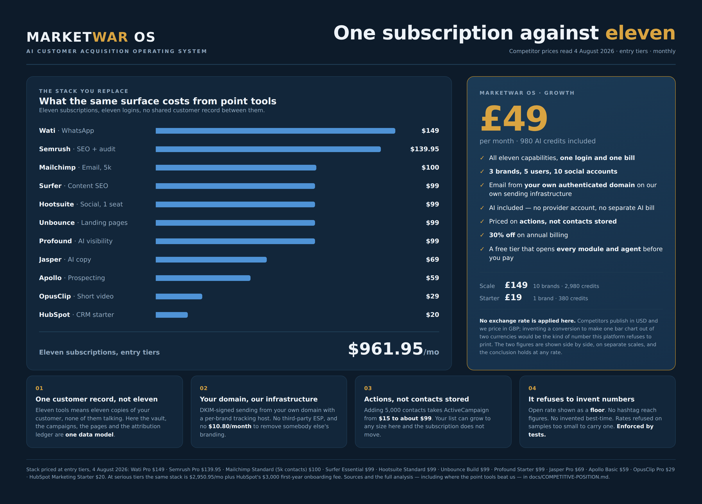

# Where MarketWar OS stands — features, prices, competitors, value

**Compiled 4 August 2026.** Competitor prices were looked up on that date and are
cited. Everything about our own platform is counted from the code in this
repository, not from marketing copy.

---

## 0. How to read this, and what it is worth

Three kinds of number appear below, and they are not equally reliable.

| Marked | Means | Reliability |
|---|---|---|
| **counted** | Taken from this repository by running code — plan tables, ACU costs, engine and agent registries, route audits. | Exact. Reproduce with `node --import tsx` against `src/backend/subscription.ts`, `src/backend/wallet.ts`, `src/shared/engine-registry.ts`. |
| **cited** | A competitor's published price, with the source and the date it was read. | As good as the source. Several are secondary (pricing-guide sites) rather than the vendor's own page, because some vendor pricing pages refuse automated fetches — `opus.pro/pricing` returned HTTP 403. Treat secondary figures as indicative and re-check before quoting them to a customer. |
| **derived** | Arithmetic on the two above — stack totals, per-action costs. | Only as good as its inputs, and the inputs are shown so the arithmetic can be checked. |

**No currency conversion is applied anywhere in this document.** Competitors
publish in USD, we price in GBP, and inventing an exchange rate to make a table
line up would be exactly the kind of number this platform refuses to print
elsewhere. Where a total is compared, both currencies are stated and the
conclusion is one that holds at any plausible rate — a four-figure dollar stack
against a two-figure pound subscription does not turn on the spot rate.

---

## 1. What we actually ship — counted

| Thing | Count | Source |
|---|---|---|
| Dashboard surfaces | **59** | directories under `src/app/dashboard` |
| API routes | **147** | `route.ts` files under `src/app/api` |
| Documented engines (each with its own API + zero-config demo) | **55** | `ENGINE_REGISTRY` |
| Runnable AI agents | **39** | `AGENT_LIST` |
| Command-Centre front-line units | **26** in 6 divisions under one commander | `ARMY` / `DIVISIONS` |
| Of those 26, live with no external key | **23** | `armyStats()` |
| Needing a connector before they act | **3** — paid-ads auto-launch, multi-channel social publishing, live WhatsApp send | each names its own unlock |

The engines by category: Economics & Governance (16), Market Intelligence (9),
Acquisition & Campaigns (7), Engagement & Retention (6), Content & Reporting (6),
Local & Marketplace (5), Video Intelligence (3), Autonomy & Orchestration (3).

### Our price list — counted

| Plan | £/month | Monthly ACUs | Brands | Users | Socials | Campaigns |
|---|---|---|---|---|---|---|
| Free | 0 | 100 (one-off) | 1 | 1 | 1 | 1 |
| Starter | 19 | 380 | 1 | 2 | 3 | 5 |
| **Growth** | **49** | **980** | 3 | 5 | 10 | 20 |
| Scale | 149 | 2,980 | 10 | 15 | 30 | 100 |
| Business | 399 | 7,980 | 30 | 40 | 100 | 500 |
| Enterprise | 999 | 19,980 | 100 | 100 | 300 | unlimited |
| Corporate | 2,499 | 49,980 | 300 | 300 | 1,000 | unlimited |
| Global | 7,499 | ~149,980 | custom | custom | custom | unlimited |

`ACU_PER_GBP = 100` (1 ACU = 1p) · `ACU_ALLOCATION_RATE = 0.2` (the allowance is
20% of the subscription) · `ANNUAL_DISCOUNT = 0.3` · `STANDARD_MARKUP = 4`
(4× provider cost = 75% gross margin) · `MARKUP_FLOOR = 2` (the owner's 100%
net-profit floor, asserted by tests).

**What an action costs — counted** (`ACTION_COST_ACU`):

| Action | ACUs | = £ |
|---|---|---|
| LLM completion | 5 | 0.05 |
| Paid search | 2 | 0.02 |
| Image | 10 | 0.10 |
| Contact enrichment (per row) | 2 | 0.02 |
| Voice (per 1,000 chars) | 34 | 0.34 |
| Video dub (per minute) | 140 | 1.40 |
| Nominal (report, publish, export, sync) | 1 | 0.01 |

Video renders are priced separately in `JOB_COST_ACU`, charged at enqueue and
refunded on failure.

**What that buys on Growth (£49) — derived:** 980 ACUs is **196 LLM actions**, or
98 images, or 490 enrichments, or any mix. Top-ups are available at the same
£1 = 100 ACUs.

---

## 2. The competitor set, priced

Prices read 4 August 2026. Monthly rates unless stated.

### All-in-one marketing platforms

| Product | Entry | Next real tier | Note |
|---|---|---|---|
| **HubSpot Marketing Hub** | $15/seat annual, $20/seat monthly (Starter) | **$890/mo** (Professional, 3 seats, 2,000 contacts) | Professional carries a **mandatory $3,000 first-year onboarding fee**. The Starter→Professional jump is ~44×. ([HubSpot pricing guide](https://blog.hubspot.com/marketing/hubspot-marketing-hub-pricing), [Docket research](https://www.docket.io/resources/research/hubspot-marketing-hub-pricing), [TinyCommand](https://tinycommand.com/blogs/hubspot-pricing-explained)) |
| **ActiveCampaign** | $15/mo (Starter, 1,000 contacts, annual) | Plus $49 · Professional $79 · Enterprise $145 | Contact-priced. Adding 5,000 contacts takes Starter to ~$99/mo. ([BuyerSprint](https://buyersprint.com/2026/05/08/activecampaign-pricing-2026/), [EmailVendorSelection](https://www.emailvendorselection.com/activecampaign-pricing/)) |
| **Brevo** | $9/mo (Starter, 5k emails) | Business $18/mo at 5k emails | Volume-priced, not contact-priced. Removing Brevo branding is a **$10.80/mo add-on**. ([EmailToolTester](https://www.emailtooltester.com/en/reviews/brevo/pricing/), [CostBench](https://costbench.com/software/marketing-automation/brevo/)) |
| **Mailchimp** | $13/mo Essentials · $20/mo Standard (500 contacts) | **$100/mo Standard at 5,000 contacts** | Priced on contacts stored, not features or sends. ([EmailToolTester](https://www.emailtooltester.com/en/reviews/mailchimp/pricing/), [Retainful](https://www.retainful.com/blog/mailchimp-pricing)) |

### SEO and content

| Product | Entry | Higher tiers |
|---|---|---|
| **Semrush** | $139.95/mo (Pro) | Guru $249.95 · Business $499.95 ([DemandSage](https://www.demandsage.com/semrush-pricing/), [Tekpon](https://tekpon.com/software/semrush/pricing/)) |
| **Ahrefs** | $29/mo (Starter, monthly only) · $129/mo (Lite) | Standard $249 · Advanced $449 · Enterprise from $1,499 ([ClaroRank](https://clarorank.com/ahrefs-pricing/), [GetPricePulse](https://www.getpricepulse.com/companies/ahrefs-pricing.html)) |
| **Surfer SEO** | $99/mo (Essential — 30 content-editor articles, 5 AI articles, 100 page audits) | Scale $219/mo ([eesel](https://www.eesel.ai/blog/surfer-seo-pricing), [AffiliateBooster](https://www.affiliatebooster.com/surfer-seo-pricing/)) |

### AI answer-engine visibility (GEO/AEO)

| Product | Entry | Note |
|---|---|---|
| **Profound** | $99/mo Starter — **ChatGPT only**, 50 prompts, one region, one seat | Growth $399/mo for 100 prompts across three engines; full coverage is Enterprise, typically $2,000+/mo ([WorkDuo](https://www.workduo.ai/blog/profound-ai-pricing), [ThatMarketingBuddy](https://thatmarketingbuddy.com/pricing/profound)) |

### Social, video, pages, outreach, messaging

| Product | Price | Note |
|---|---|---|
| **Hootsuite** | $99/user/mo Standard (5 accounts) · $249/user/mo Advanced | Annual billing only on Standard ([CostBench](https://costbench.com/software/social-media-management/hootsuite/), [SocialChamp](https://www.socialchamp.com/blog/hootsuite-pricing/)) |
| **OpusClip** | $29/mo Pro — **300 credits = 300 upload-minutes**; 1 credit per source minute regardless of clips produced; credits expire in 60 days | ([FluxNote](https://fluxnote.io/guides/opus-clip-pricing-2026), [eesel](https://www.eesel.ai/blog/opusclip-pricing)) |
| **Unbounce** | $99/mo Build (20,000 visitors, 500 conversions) | Experiment $149 · Optimize $249 · Concierge $625+ ([LanderLab](https://landerlab.io/blog/unbounce-pricing), [Leadpages](https://leadpages.com/blog/unbounce-pricing)) |
| **Jasper** | $69/seat/mo Pro ($59 annual) | The Creator tier was withdrawn; Pro is now the entry ([eesel](https://www.eesel.ai/blog/jasper-ai-pricing), [DemandSage](https://www.demandsage.com/jasper-ai-pricing/)) |
| **Apollo.io** | $59/user/mo Basic monthly ($49 annual) · Pro $99 | Credit-metered on top ([Warmly](https://www.warmly.ai/p/blog/apollo-pricing), [PhantomBuster](https://phantombuster.com/blog/ai-automation/apollo-pricing/)) |
| **Wati** (WhatsApp) | $149/mo Pro monthly ($119 annual), 5 seats | Plus Meta's per-message fees with a **~20% markup**, and $24/extra seat; real bills run 30–50% above list ([Chatarmin](https://chatarmin.com/en/blog/wati-pricing), [FlowCart](https://www.flowcart.ai/blog/wati-pricing)) |

---

## 3. The stack test

The honest way to price a platform this broad is to ask what a business would pay
to assemble the same surface from the best-known point tools.

*The figure above is generated from `docs/assets/marketwar-vs-stack.html` — the
same numbers as the tables below, in the brand's navy and gold. The dollar bars
share one axis with each other only; the £49 sits on its own card, because no
exchange rate is applied.*

### Entry-tier stack — derived

| Capability | Tool, entry tier | $/month |
|---|---|---|
| SEO research + site audit | Semrush Pro | 139.95 |
| Content optimisation | Surfer Essential | 99 |
| Email marketing (5k contacts) | Mailchimp Standard | 100 |
| Social scheduling | Hootsuite Standard (1 seat) | 99 |
| Landing pages | Unbounce Build | 99 |
| AI copywriting | Jasper Pro (1 seat) | 69 |
| Short-form video clipping | OpusClip Pro | 29 |
| Prospecting + enrichment | Apollo Basic (1 seat) | 59 |
| WhatsApp business messaging | Wati Pro | 149 |
| AI-search visibility | Profound Starter | 99 |
| CRM / marketing automation | HubSpot Marketing Starter | 20 |
| **Total** | | **$961.95/month** |

Eleven subscriptions, eleven logins, eleven billing relationships, no shared
customer record between them — and that is the *cheapest* configuration, most of
it single-seat, before Meta's per-message fees or any contact-count growth.

### Serious-tier stack — derived

Semrush Guru 249.95 + Ahrefs Standard 249 + Surfer Scale 219 + Mailchimp Standard
100 + Hootsuite Advanced 249 + Unbounce Optimize 249 + Jasper Pro 69 + OpusClip
Pro 29 + Apollo Professional 99 + Wati Pro 149 + Profound Growth 399 + HubSpot
Marketing Professional 890 = **$2,950.95/month**, plus HubSpot's **$3,000
first-year onboarding**.

### Against our list

- **Growth, £49/month**, includes 980 ACUs — 196 AI actions before a top-up.
- A heavy month with a £30 top-up is **£79**.
- Scale, £149/month, carries 10 brands and 2,980 ACUs.

The ratio is not close, and no exchange rate makes it close. That is the
commercial headline — and section 5 is where it stops being flattering.

---

## 4. Feature map — where each capability sits

| Capability | Ours | The point tool it displaces | Their entry price |
|---|---|---|---|
| Keyword/SEO workbench, site audit | Search Dominance, SiteRaid, OMNIRANK | Semrush / Ahrefs | $129–$140 |
| Content optimisation + briefs | Content Factory, Organic Dominance | Surfer | $99 |
| Programmatic SEO pages | Programmatic SEO Builder, with a computed internal link mesh | Semrush + a developer | — |
| AI answer-engine visibility | AI Visibility, Citation Radar, AI Answer Accuracy | Profound | $99 (ChatGPT only) |
| Blog + autopilot | SEO Autopilot, per-brand, links built from the brand's own sitemap | Surfer AI / agency retainer | $99+ |
| Backlinks | Link Opportunity Engine — **earned, never placed** | Pitchbox / BuzzStream / agency | — |
| Email marketing | Email Centre on **our own sending infrastructure**, per-brand DKIM + tracking domain | Mailchimp / Brevo / ActiveCampaign | $20–$100 |
| Landing pages | Landing Builder + per-page analytics | Unbounce / Leadpages | $99 |
| Social content + publishing | Content Factory, Publish | Hootsuite / Buffer | $99/seat |
| Short-form video | Clip Finder + browser render (9:16, captions, logo, B-roll) | OpusClip / Descript | $29 |
| Ad copy + creative | Campaign Builder, VisualStrike, Brand Studio | Jasper + AdCreative | $69/seat |
| Prospecting + enrichment | LeadWar Room, enrichment per row | Apollo | $59/seat |
| WhatsApp funnel | WhatsApp Sales Centre | Wati / Respond.io | $149 |
| CRM + segmentation | Customer Vault, Segments, Unified Inbox | HubSpot / ActiveCampaign | $20–$890 |
| Attribution + ROI | Money Ledger, ROI Engine, Revenue Attribution | HubSpot Pro / Triple Whale | $890 |
| Governance | ProfitGuard, Claims & Compliance, RightsGuard, consent + suppression ledgers | — mostly nobody | — |

---

## 5. Where the stack beats us — and it does

A comparison that only flatters us is worthless. These are real.

1. **We have no proprietary index.** Semrush and Ahrefs own crawled backlink
   graphs and keyword-volume databases built over a decade. We use live search
   and the customer's own data. **We cannot tell you a keyword's monthly search
   volume or a competitor's full backlink profile**, and no amount of AI closes
   that gap — it is a data-asset gap, not a software gap. A customer who needs
   volume data needs Semrush or Ahrefs as well as us.
2. **Deliverability reputation is earned in calendar time.** Mailchimp's
   sending reputation is older than most of its customers. Ours is a warm-up
   ramp on a new domain. The engineering is right — SPF/DKIM/DMARC, one-click
   unsubscribe, suppression ledger, per-brand tracking host — but reputation is
   not a feature you ship.
3. **Native publishing is connector-gated.** Hootsuite publishes to 15+
   networks out of the box. Three of our 26 front-line units need a connector
   before they act, and social publishing is one of them.
4. **No contact database.** Apollo sells access to hundreds of millions of
   records. We enrich from live search, row by row. Different product, and for
   pure outbound prospecting theirs is stronger.
5. **Video rendering is the customer's device or a worker.** OpusClip runs a
   hosted GPU farm. Our browser render costs nobody anything and needs no
   supplier — but it is bounded by the machine it runs on.
6. **Integrations, support, and trust.** HubSpot has a marketplace of over a
   thousand integrations and an onboarding organisation. We are new, and a new
   platform asking a business to move its customer list is asking for a lot.
7. **Breadth is not depth.** 55 engines and 39 agents is a wide surface. In any
   single column, a category leader that has done one thing for ten years will
   beat us on that thing. The argument for us is the *whole*, not any part.

---

## 6. Where we are genuinely better, with the evidence

1. **We refuse to print numbers we cannot measure — and no competitor does.**
   This is the deepest difference and it is enforced in code and tests:
   - the email open rate is shown as a **floor**, because a reader who clicked
     without loading images opened the message whatever the pixel says;
   - a click rate the platform has judged unreliable is graded *unknown* and
     rendered white, never green;
   - hashtags carry **no volume, reach or difficulty figures**, because nobody
     selling a hashtag tool can measure any of them for the account using it;
   - "best time to post" says which of three tiers it is on — measured, market
     hours, or nothing — instead of inventing a Tuesday;
   - conversion rates are refused outright below 100 views, and campaign
     percentages below 200 sends;
   - SiteRaid refuses to score a site it could not read rather than scoring the
     refusal.
   Every one of those has a test, and most have a mutation test proving the
   test would catch its removal. **The industry norm is the opposite**: a
   fabricated reach figure beside every hashtag and a best-time chart on data
   nobody collected.
2. **The customer sends from their own domain on our own infrastructure.** No
   third-party ESP, no vendor branding to buy off for $10.80/month, a per-brand
   tracking host so one customer's reputation cannot poison another's links.
3. **Priced on actions, not on contacts stored.** The industry's most reliable
   hidden escalator is contact-count billing: ActiveCampaign goes from $15 to
   ~$99 when a customer adds 5,000 contacts they may never email. We charge for
   work done. A customer's list can grow to any size without the subscription
   moving.
4. **Multi-brand at the bottom of the range.** Three brands on £49; ten on £149.
   Agencies elsewhere pay per seat or per workspace — Hootsuite is $99 *per user*
   before a second brand exists.
5. **Compliance is built in rather than sold as an add-on.** Consent-gated
   sending, an auto-populating suppression ledger, PECR-compliant cookie consent
   with equal-prominence refusal, claim verification before publishing, and a
   backlink engine that earns links instead of placing them — because placement
   breaches Google's link-spam policy and the penalty lands on the customer's
   domain, not ours.
6. **The AI is included and provider-neutral.** No provider account, no separate
   AI bill, no keys to manage, and routing across more than one provider so a
   single provider's bad day does not stop the work.
7. **Governance nobody else ships**: ProfitGuard refuses to scale a low-margin
   product, the platform's own AI spend has a ceiling, and every AI action is
   metered and gated — verified by a call-graph test over all 147 routes.

---

## 7. Commercial findings the owner should act on

These came out of the analysis and are not rhetorical.

### 7.1 Seven priced actions are defined and never charged

`ACTION_COST_ACU` prices fifteen action kinds. A route audit shows only eight are
ever metered. **Never charged anywhere:** `video`, `post`, `publish_page`,
`publish_social`, `email_send`, `data_export`, `connector_sync`.

`email_send` is the significant one: it is priced at 1 ACU (1p) per recipient and
**almost no send path charges it**. Campaign sending is still free at any volume.

*Updated 2026-08-04:* the review-request send path (`/api/review-requests`,
`action: "send"`) does charge it, per recipient, before the send — so
`email_send` is no longer literally uncharged everywhere. That is one route out
of every route that sends, and it does not change the finding below: the
Email Centre, the campaign engine and the nightly digest still send for nothing.
The decision the owner has to make is unchanged, and is now slightly more
urgent, because two paths priced differently for the same physical act is the
worst of the three options.

Two ways to read that, and the owner should pick deliberately rather than by
omission:

- *As a weapon.* Unlimited sending at no per-recipient cost is a real advantage
  over Mailchimp's $100/month at 5,000 contacts, and worth saying out loud on
  the pricing page.
- *As leakage.* At 1p a recipient, a customer emailing 5,000 contacts weekly is
  20,000 sends a month — £200 of priced-but-uncollected work, against a £49
  subscription, on infrastructure that costs us real money to run.

Note the arithmetic cuts both ways: at 1p per recipient we would be **cheaper
than Mailchimp for one send a month to 5,000 contacts (£50 vs $100) and more
expensive at three sends (£150 vs $100)**. If sending is ever switched on, the
per-recipient rate needs re-deriving against send *frequency*, not just list
size, or the pricing page will be making a promise the meter breaks.

### 7.2 The Growth allowance is thin for a heavy user

980 ACUs is 196 LLM actions. A customer running the daily briefing, a weekly blog
post, segment refreshes and campaign copy will pass that inside a month and hit a
top-up prompt. That is the model working — but Jasper sells "unlimited" words at
$69/seat, and "you have run out" reads worse than an invoice, however fair it is.
Worth watching the first cohort's actual consumption before defending the 20%
allocation rate.

### 7.3 The comparison to lead with is the stack, not the feature list

Feature-by-feature we lose columns to specialists. **$961.95/month of entry-tier
point tools against £49** is the argument, and it is strongest for the customer
who currently owns three or four of those subscriptions and knows what they cost.

### 7.4 Two claims we can make that competitors cannot

- *"We will tell you when we don't know."* Nothing else in this market does, and
  it is provable — the refusals are in the product, not the brochure.
- *"Your list can grow to any size and your bill does not move."* True today,
  and directly contradicts the contact-priced majority of the category.

---

## 8. Summary

| | |
|---|---|
| **What we are** | A single operating system covering eleven categories that are normally eleven subscriptions. |
| **What it costs** | £49/month for the working tier, plus AI consumption at 1p per ACU. |
| **What it replaces** | $961.95/month of entry-tier point tools; $2,950.95 at serious tiers, plus a $3,000 HubSpot onboarding fee. |
| **Where we lose** | Proprietary SEO index data, sending reputation age, native multi-channel publishing, contact databases, integration marketplaces, and depth in any single column. |
| **Where we win** | Price by a wide margin; one customer record instead of eleven; owned sending infrastructure; action-priced instead of contact-priced; governance and compliance built in; and a measurement discipline that refuses to invent the numbers the rest of the category prints without blinking. |

---

### Sources

All read 4 August 2026. Vendor pages are cited where they could be fetched;
several vendors block automated access, and those rows use pricing-guide sources
and are marked indicative in section 0.

HubSpot: [hubspot.com](https://blog.hubspot.com/marketing/hubspot-marketing-hub-pricing) ·
[docket.io](https://www.docket.io/resources/research/hubspot-marketing-hub-pricing) ·
[tinycommand.com](https://tinycommand.com/blogs/hubspot-pricing-explained) —
Semrush: [demandsage.com](https://www.demandsage.com/semrush-pricing/) ·
[tekpon.com](https://tekpon.com/software/semrush/pricing/) —
Ahrefs: [clarorank.com](https://clarorank.com/ahrefs-pricing/) ·
[getpricepulse.com](https://www.getpricepulse.com/companies/ahrefs-pricing.html) —
Surfer: [eesel.ai](https://www.eesel.ai/blog/surfer-seo-pricing) ·
[affiliatebooster.com](https://www.affiliatebooster.com/surfer-seo-pricing/) —
Mailchimp: [emailtooltester.com](https://www.emailtooltester.com/en/reviews/mailchimp/pricing/) ·
[retainful.com](https://www.retainful.com/blog/mailchimp-pricing) —
Brevo: [emailtooltester.com](https://www.emailtooltester.com/en/reviews/brevo/pricing/) ·
[costbench.com](https://costbench.com/software/marketing-automation/brevo/) —
ActiveCampaign: [buyersprint.com](https://buyersprint.com/2026/05/08/activecampaign-pricing-2026/) ·
[emailvendorselection.com](https://www.emailvendorselection.com/activecampaign-pricing/) —
Hootsuite: [costbench.com](https://costbench.com/software/social-media-management/hootsuite/) ·
[socialchamp.com](https://www.socialchamp.com/blog/hootsuite-pricing/) —
OpusClip: [fluxnote.io](https://fluxnote.io/guides/opus-clip-pricing-2026) ·
[eesel.ai](https://www.eesel.ai/blog/opusclip-pricing) —
Unbounce: [landerlab.io](https://landerlab.io/blog/unbounce-pricing) ·
[leadpages.com](https://leadpages.com/blog/unbounce-pricing) —
Jasper: [eesel.ai](https://www.eesel.ai/blog/jasper-ai-pricing) ·
[demandsage.com](https://www.demandsage.com/jasper-ai-pricing/) —
Apollo: [warmly.ai](https://www.warmly.ai/p/blog/apollo-pricing) ·
[phantombuster.com](https://phantombuster.com/blog/ai-automation/apollo-pricing/) —
Wati: [chatarmin.com](https://chatarmin.com/en/blog/wati-pricing) ·
[flowcart.ai](https://www.flowcart.ai/blog/wati-pricing) —
Profound: [workduo.ai](https://www.workduo.ai/blog/profound-ai-pricing) ·
[thatmarketingbuddy.com](https://thatmarketingbuddy.com/pricing/profound)
